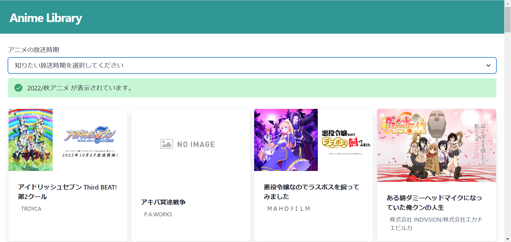

# Anime Library

## バックエンド

https://animes-library2.netlify.app/

## フロントエンドで表示しているデータ

https://github.com/OHMORIYUSUKE/animeapp-db/tree/api

### 利用したもの

#### 言語

- TypeScript

#### API

- ShangriLa Anime API

## フロントエンド

### プログラム

https://github.com/OHMORIYUSUKE/animeapp-web
